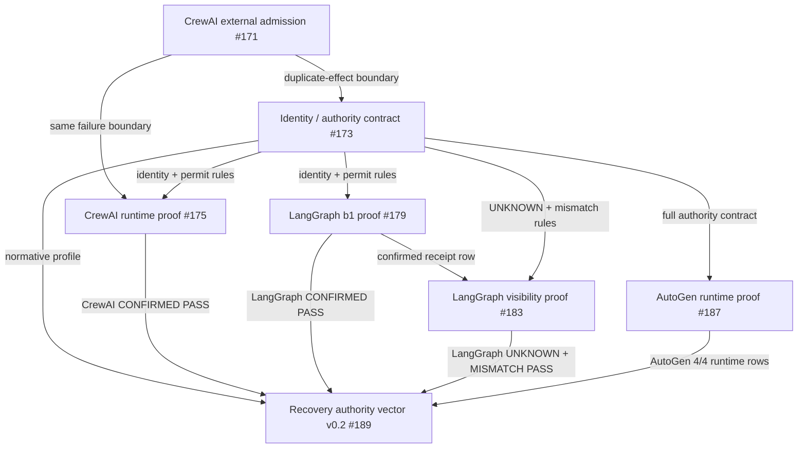

# ContractGraph External Proof Registry v0.1

This directory is the first minimal **Proof Platform** primitive for ContractGraph-QA.

It turns a set of merged proof artifacts into a machine-verifiable directed acyclic graph (DAG) of bounded claims.

The registry does **not** assign trust scores. It records exactly which immutable proof produced a claim, which downstream proof consumed it, and which claims were explicitly allowed to cross that boundary.

## Core rule

> A downstream proof may add a new claim only from its own evidence. It may inherit an upstream claim only when a registry edge explicitly carries that exact claim.

This operationalizes the project principle:

> Each external proof lowers the cost of the next trust decision only when the previous proof's exact subject, boundary, result, and non-claims survive into the next step.

## v0.1 graph



## Files

- `registry.v0.1.json` — frozen proof nodes, bounded claims, non-claims, and claim-carrying edges.
- `schema.v0.1.json` — portable JSON Schema for registry consumers.
- `verify_registry.py` — stdlib-only verifier used by CI.
- `query_registry.py` — small CLI for claim ownership and proof-lineage queries.

## What the verifier proves

For every registered node it checks:

1. the declared merge commit exists in Git history;
2. the historical artifact exists at exactly that commit;
3. `git rev-parse <commit>:<path>` matches the declared Git blob SHA;
4. the historical artifact is valid JSON;
5. every claim ID is owned by exactly one node;
6. every edge carries only claims actually owned by its source;
7. the downstream node explicitly declared every carried claim in `claim_inputs`;
8. every `claim_input` is supplied exactly once by an incoming edge;
9. the graph is acyclic.

The important negative guarantee is structural: **a claim cannot become inherited evidence just because two proofs are related conceptually.** The handoff must exist in the registry and name the exact claim.

## Verify locally

The verifier needs full Git history because historical merge commits are part of the evidence boundary.

```bash
git fetch --unshallow 2>/dev/null || true
python proof-registry/verify_registry.py
```

Optionally write a machine-readable verification summary:

```bash
python proof-registry/verify_registry.py \
  --write-summary /tmp/proof-registry-summary.json
```

## Query claim lineage

Ask who owns a claim and where it flows next:

```bash
python proof-registry/query_registry.py \
  --claim contract.unknown_not_retry_authority
```

Inspect one proof node, its predecessors, successors, claim inputs, claims and non-claims:

```bash
python proof-registry/query_registry.py \
  --node recovery-authority-vector-v0.2
```

The query CLI reads the registry only; it does not turn an `UNTESTED` or non-claim into evidence.

## Claim ceiling

Registry verification establishes **lineage and immutable artifact identity**, not truth in the abstract.

It does not prove that:

- an upstream witness or external system is truthful;
- an omitted event never occurred;
- a runtime is safe outside its declared proof boundary;
- two linked claims imply causality beyond the explicit `carries` list;
- any framework deserves a scalar safety or trust score.

## Next platform layers

The v0.1 registry is intentionally UI-independent. A future viewer or API can consume the same JSON without changing the evidence semantics. Useful extensions include external submitter identities, signed admissions, revocation/supersession edges, protocol namespaces (TIP / DRP / DI / DIF), and queryable claim trajectories.
